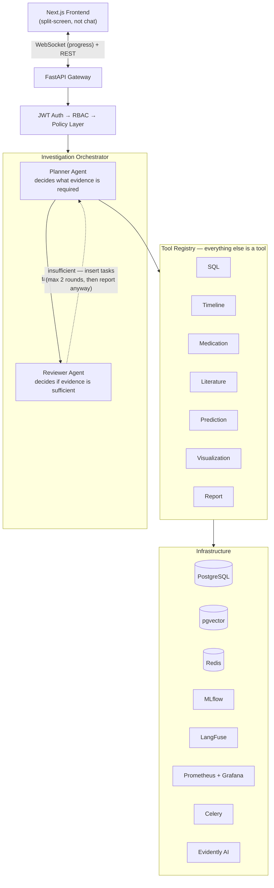

# Clinical Investigation Agent (CIA)

An AI-powered system that autonomously investigates complex patient and claims cases — gathering evidence from structured clinical data, medical literature, drug knowledge, and predictive models to produce evidence-backed, traceable investigation reports.

**Anchor scenario:** A physician asks *"Why did this patient's creatinine double?"* A Planner agent builds an investigation plan, gathers evidence across SQL, timeline reconstruction, medication history, and literature; a Reviewer agent checks whether that evidence is sufficient; the system produces a cited, structured report — every claim traceable back to the artifact that produced it.

This is **not** a chatbot, **not** Clinical Decision Support, and **not** a RAG demo — see the [design document](./clinical-investigation-agent-design.md) for the full reasoning behind those boundaries.

A physician or insurance adjuster investigating a case today has to manually cross-reference systems that don't talk to each other — EHR records, drug references, medical literature, prior claims. This system investigates autonomously and presents grounded evidence; a human still decides. It never recommends treatment or asserts a diagnosis is correct.

## How it works



Full architecture, domain models, RBAC design, data sourcing decisions, capability matrix, known limitations, and the phase-by-phase build plan live in **[clinical-investigation-agent-design.md](./clinical-investigation-agent-design.md)**.

## Tech stack

| Layer | Choice |
|---|---|
| Frontend | Next.js |
| Backend API | FastAPI |
| Agent orchestration | Custom Planner/Reviewer (no agent framework) |
| LLM | OpenAI API (GPT-4o-class model) |
| Operational DB | PostgreSQL (Synthea schema) |
| Vector store | pgvector (PubMed literature) |
| Session/queue | Redis + Celery |
| ML tracking/registry/serving | MLflow |
| Model monitoring | Evidently AI |
| Tracing | LangFuse |
| Metrics | Prometheus + Grafana |
| Evaluation | RAGAS, in CI |
| Auth | JWT |
| Testing | pytest + pytest-asyncio |
| DB migrations | Alembic |
| CI/CD | GitHub Actions |
| Containerization | Docker Compose |

## Project status

Pre-implementation — data foundation in progress. See the design doc's build plan (Phase 0 onward: core Planner→Tool→Reviewer→Report loop first, infra layered on after) for what's built vs. planned.

## Getting started

### Requirements
- Recent JDK to run the Synthea generator (tested with `java version "25.0.4" 2026-07-21 LTS`)

### Generate synthetic patient data

The `synthea_data/` folder (generated CSV/FHIR output + the Synthea jar) is **not** committed to this repo — it's synthetic data regenerated on demand, and the jar is a third-party build artifact, not project code.

```bash
mkdir synthea_data && cd synthea_data
curl -sL -o synthea-with-dependencies.jar https://github.com/synthetichealth/synthea/releases/download/master-branch-latest/synthea-with-dependencies.jar
java -Xmx4g -jar synthea-with-dependencies.jar --exporter.csv.export=true --exporter.baseDirectory=./output -p 2000 Massachusetts
```

`-p 2000` targets 2,000 *living* patients — Synthea additionally exports everyone who died during their simulated lifetime, so the actual `patients.csv` row count comes out higher (2,338 in the current dev dataset). `-Xmx4g` raises the JVM heap; bump it further if generating a larger population (up to the 5,000 recommended ceiling — see the design doc §7) causes an out-of-memory error.

This pulls the latest `master-branch-latest` Synthea build without a pinned seed, so patient records will differ slightly between runs. That's expected: the agent answers questions against whatever patient data is currently loaded, not a fixed benchmark set.
