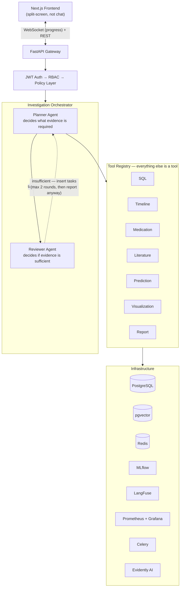

# Clinical Investigation Agent (CIA)

An AI-powered system that autonomously investigates complex patient and claims cases — gathering evidence from structured clinical data, medical literature, drug knowledge, and predictive models to produce evidence-backed, traceable investigation reports.

**Anchor scenario:** A physician asks *"Why did this patient's creatinine double?"* A Planner agent builds an investigation plan, gathers evidence across SQL, timeline reconstruction, medication history, and literature; a Reviewer agent checks whether that evidence is sufficient; the system produces a cited, structured report — every claim traceable back to the artifact that produced it.

This is **not** a chatbot, **not** Clinical Decision Support, and **not** a RAG demo — see the [design document](./clinical-investigation-agent-design.md) for the full reasoning behind those boundaries.

A physician or insurance adjuster investigating a case today has to manually cross-reference systems that don't talk to each other — EHR records, drug references, medical literature, prior claims. This system investigates autonomously and presents grounded evidence; a human still decides. It never recommends treatment or asserts a diagnosis is correct.

## How it works


```mermaid
flowchart TD
    FE["Next.js Frontend<br/>(split-screen, not chat)"]
    GW["FastAPI Gateway"]
    AUTH["JWT Auth → RBAC → Policy Layer"]

    subgraph ORCH["Investigation Orchestrator"]
        direction LR
        PLANNER["Planner Agent<br/>decides what evidence is required"]
        REVIEWER["Reviewer Agent<br/>decides if evidence is sufficient"]
        PLANNER -->|tasks| REVIEWER
        REVIEWER -.->|"insufficient — insert tasks<br/>(max 2 rounds, then report anyway)"| PLANNER
    end

    subgraph TOOLS["Tool Registry — everything else is a tool"]
        direction LR
        SQL[SQL]
        TIMELINE[Timeline]
        MED[Medication]
        LIT[Literature]
        PRED[Prediction]
        VIZ[Visualization]
        REPORT[Report]
    end

    subgraph INFRA["Infrastructure"]
        direction LR
        PG[("PostgreSQL")]
        VEC[("pgvector")]
        REDIS[("Redis")]
        MLFLOW["MLflow"]
        LANGFUSE["LangFuse"]
        MON["Prometheus + Grafana"]
        CELERY["Celery"]
        EVID["Evidently AI"]
    end

    FE <-->|"WebSocket (progress) + REST"| GW
    GW --> AUTH --> ORCH
    PLANNER --> TOOLS
    TOOLS --> INFRA
```

Full architecture, domain models, RBAC design, data sourcing decisions, capability matrix, known limitations, and the phase-by-phase build plan live in **[clinical-investigation-agent-design.md](./clinical-investigation-agent-design.md)**.

## Tech stack

| Layer | Choice |
|---|---|
| Frontend | Next.js |
| Backend API | FastAPI |
| Agent orchestration | Custom Planner/Reviewer (no agent framework) |
| LLM | OpenAI API (GPT-4o-class model) |
| Operational DB | PostgreSQL (Synthea schema) |
| Vector store | pgvector (PubMed literature) |
| Session/queue | Redis + Celery |
| ML tracking/registry/serving | MLflow |
| Model monitoring | Evidently AI |
| Tracing | LangFuse |
| Metrics | Prometheus + Grafana |
| Evaluation | RAGAS, in CI |
| Auth | JWT |
| Testing | pytest + pytest-asyncio |
| DB migrations | Alembic |
| CI/CD | GitHub Actions |
| Containerization | Docker Compose |

## Project status

Phase 0 (data foundation) nearly complete: 18-table Synthea schema loaded into Postgres, LOINC lookup table loaded. RxNorm pending a UMLS license approval. See the design doc's build plan (Phase 0 onward: core Planner→Tool→Reviewer→Report loop first, infra layered on after) for what's built vs. planned.

## Getting started

### Requirements
- Recent JDK to run the Synthea generator (tested with `java version "25.0.4" 2026-07-21 LTS`)

### Data folder layout

All generated/downloaded data lives under `data/` at the repo root, gitignored (regenerated/redownloaded on demand, never committed):

```
data/
  synthea/       # Synthea jar + generated CSV/FHIR output (see below)
  lookup/
    loinc/       # LoincTableCore.csv
    rxnorm/      # RXNCONSO.RRF (once UMLS access is approved)
```

### Generate synthetic patient data

```bash
mkdir -p data/synthea && cd data/synthea
curl -sL -o synthea-with-dependencies.jar https://github.com/synthetichealth/synthea/releases/download/master-branch-latest/synthea-with-dependencies.jar
java -Xmx4g -jar synthea-with-dependencies.jar --exporter.csv.export=true --exporter.baseDirectory=./output -p 2000 Massachusetts
```

`-p 2000` targets 2,000 *living* patients — Synthea additionally exports everyone who died during their simulated lifetime, so the actual `patients.csv` row count comes out higher (2,338 in the current dev dataset). `-Xmx4g` raises the JVM heap; bump it further if generating a larger population (up to the 5,000 recommended ceiling — see the design doc §7) causes an out-of-memory error.

This pulls the latest `master-branch-latest` Synthea build without a pinned seed, so patient records will differ slightly between runs. That's expected: the agent answers questions against whatever patient data is currently loaded, not a fixed benchmark set.

### Load Synthea data into Postgres

Bring up Postgres (`docker compose up -d postgres` from repo root) and run migrations (`cd backend && uv run alembic upgrade head`), then:

```bash
cd backend
uv run python scripts/load_csv_data.py
```

Truncates and reloads all 18 tables from `data/synthea/output/csv/`, in FK-dependency order, inside a single transaction. Safe to re-run any time you regenerate `data/synthea/`.

### Lookup vocabularies (LOINC, RxNorm)

No ICD-10-CM table: verified against real loaded data that Synthea uses SNOMED-CT, not ICD-10-CM, for both `conditions.CODE` and `claims.DIAGNOSISn` (0 matches out of hundreds of distinct codes checked) — SNOMED-CT is explicitly out of scope for this project (design doc §5), so an ICD-10 lookup table has nothing to resolve here and was dropped rather than kept as dead weight. LOINC, by contrast, resolves ~92% of `observations.CODE` values directly, and is genuinely load-bearing.

**LOINC**:
1. Create a free account at [loinc.org](https://loinc.org), download the latest full release zip.
2. Unzip; from inside it, place `LoincTableCore/LoincTableCore.csv` at `data/lookup/loinc/LoincTableCore.csv` (this is the stable core-columns subset — not the full `Loinc.csv`, which carries ~300+ columns of metadata not needed here).

**RxNorm** (requires a free UMLS Metathesaurus account at [uts.nlm.nih.gov](https://uts.nlm.nih.gov) — approval isn't always instant):
1. Once approved, download the current monthly RxNorm full release from the UMLS Technology Services site.
2. Unzip; place `rrf/RXNCONSO.RRF` at `data/lookup/rxnorm/RXNCONSO.RRF`.

Then load whatever's present (RxNorm is skipped with a message if its file isn't there yet):

```bash
cd backend
uv run python scripts/load_lookup_data.py
```

### MLflow (Prediction Tool)

Local tracking server (interim setup — a background process from `backend/.venv`, not yet a docker-compose service):

```bash
cd backend
uv run mlflow server --backend-store-uri "sqlite:///../data/mlflow/mlflow.db" --default-artifact-root "../data/mlflow/artifacts" --host 127.0.0.1 --port 5000
```

Verify it's up: `curl http://127.0.0.1:5000/health` should return `OK`. Leave it running in its own terminal — `prediction_tool.py` needs it reachable at request time (it fails fast with a clear error if it isn't, rather than hanging).

Train and register the readmission model (safe to re-run — registers a new version and promotes it to the `champion` alias each time):

```bash
cd backend
uv run python scripts/train_readmission_model.py
```

### Literature corpus (Literature Tool)

A small, deliberately narrow PubMed abstract corpus (~35 abstracts across 7 topics tied to the anchor scenario — see `app/db/models/literature.py`), embedded via OpenAI and stored in pgvector:

```bash
cd backend
uv run python scripts/ingest_literature.py
```

Safe to re-run (upserts by PMID). Uses PubMed's public E-utilities API — no key required at this volume, but the search endpoint is occasionally down on NCBI's end (confirmed via `einfo` still working while `esearch` returns a backend error); the script retries with backoff, but if it still fails, it's an NCBI outage, not a bug — just try again later.
