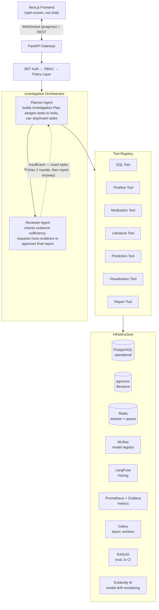
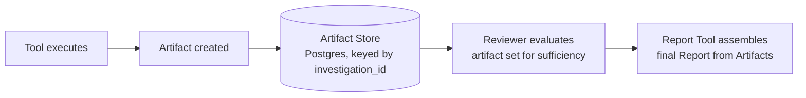

# Clinical Investigation Agent — Project Design Document

**Last updated:** August 2026

---

## 1. Problem Statement

A physician investigating a patient case, or an insurance adjuster investigating a claim, currently has to manually cross-reference multiple systems — EHR records, drug references, medical literature, prior claims — to answer questions like "why did this patient's creatinine double?" This is slow and evidence is scattered across systems that don't talk to each other.

**The system solves this by autonomously investigating a case**: gathering evidence from structured clinical data, medical literature, and predictive models, verifying that evidence is sufficient, and producing a traceable, evidence-grounded report.

### 1.1 What this explicitly is NOT

- **Not a chatbot.** No open-ended conversational interface as the primary UX.
- **Not Clinical Decision Support.** The system never recommends treatment or claims a diagnosis is correct — that's a regulated, liability-heavy claim with no reliable ground truth in synthetic data. The system investigates and presents evidence; a human decides.
- **Not a RAG demo.** Retrieval is one tool among several, not the whole system.

---

## 2. Solution Definition

### 2.1 Product definition

**Name:** Clinical Investigation Agent (CIA)

**One-line description:** An AI-powered system that autonomously investigates complex patient and claims cases by orchestrating structured clinical data, medical literature, drug knowledge, and predictive models to produce evidence-backed, traceable investigation reports.

**Anchor scenario:** A physician asks *"Why did this patient's creatinine double?"* — a planner agent builds an investigation plan, gathers evidence across SQL, timeline reconstruction, medication history, and literature, a reviewer agent checks evidence sufficiency, and the system produces a cited report.

### 2.2 Users & RBAC

Two roles, deliberately given **different investigation goals**, not just different data visibility — this is what makes the RBAC story more than "same query, fewer columns."

| Role | Investigates | Data Access | Explicitly Cannot Access |
|---|---|---|---|
| **Doctor** | Clinical cases — why did a lab value change, what caused deterioration, is this patient at readmission risk | Demographics, encounters, conditions, procedures, observations/labs, medications, care plans, allergies | Other patients outside assigned scope |
| **Insurance Adjuster** | Claims integrity — does a claim's billed procedures/diagnoses match the documented clinical record | Claims, claims_transactions, payer info, procedure/diagnosis codes, encounter metadata | Clinical notes*, lab results, medication history, detailed diagnosis timeline |

*\*Moot point in practice — see Section 4.3.2, there are no clinical notes in the dataset at all.*

RBAC is enforced **outside the LLM**: JWT → role resolution → row-level policy injection into the SQL tool, before any query touches the database. The LLM never makes an authorization decision — it operates inside a pre-filtered data boundary it cannot see past.

---

## 3. System Design

### 3.1 Architectural philosophy

> **The Planner never answers. The Planner decides what evidence is required.**
> **The Reviewer never investigates. The Reviewer asks whether the evidence is sufficient.**
> **Everything else is a Tool.**

This is a deliberate, narrow definition of "agent." Only two components get agent status because only two components make open-ended judgment calls under uncertainty (what to investigate next, whether evidence is good enough). Everything else — SQL generation, timeline construction, literature search, prediction, visualization, report writing — is a **deterministic-interface tool**: given inputs, it does one job and returns structured output. Not everything in an agentic system needs to be an agent; most of the work here is deterministic and should be treated that way.

In practice this also marks where the LLM (OpenAI API, Section 4.2) is actually called: the Planner and Reviewer call it to produce their structured JSON output, the SQL Tool calls it for NL→SQL generation, and the Report Tool calls it to write the executive summary. The Timeline, Medication, and Prediction Tools call no LLM at all — they're plain code around Postgres, RxNorm, and the MLflow-served model, respectively.

### 3.2 High-level architecture



### 3.3 The Investigation Plan (Planner output contract)

The Planner does not loop implicitly through tool calls. It emits a **structured, inspectable plan object** as its first action. This is the single most important design decision for explainability and for surfacing live progress in the UI.

```json
{
  "investigation_id": "inv_8827",
  "goal": "Investigate why patient's creatinine value increased over recent encounters",
  "role": "doctor",
  "tasks": [
    {"id": "t1", "tool": "sql",         "purpose": "Retrieve patient history and recent labs", "status": "pending"},
    {"id": "t2", "tool": "timeline",    "purpose": "Build chronological event sequence",         "status": "pending"},
    {"id": "t3", "tool": "medication",  "purpose": "Identify medication changes in the window",  "status": "pending"},
    {"id": "t4", "tool": "literature",  "purpose": "Find supporting evidence for the mechanism",  "status": "pending"},
    {"id": "t5", "tool": "reviewer",    "purpose": "Validate evidence sufficiency",               "status": "pending"},
    {"id": "t6", "tool": "report",      "purpose": "Generate final investigation report",         "status": "pending"}
  ]
}
```

Consequences of this design:
- The center panel of the UI can render live progress directly off this object (`✓ Timeline · ✓ SQL · Running Literature...`) — no separate progress-tracking logic needed.
- The Planner can **skip** tasks for simple questions (see 3.6) or **insert** new ones if the Reviewer sends evidence back as insufficient — this is a real feedback loop, not a fixed pipeline.
- **Loop termination:** the Reviewer gets a hard cap of 2 additional evidence-gathering rounds beyond the initial plan. If evidence is still marked insufficient after the cap, the Report Tool generates anyway with an explicit `evidence_complete: false` flag on the Report rather than looping indefinitely.
- Each task's tool output becomes an **artifact**, stored and rendered in the right-hand panel (Timeline / Evidence / SQL / Literature / Visualizations / Final Report tabs).

### 3.4 Domain models

The Investigation Plan is the Planner's working object, but the system needs a small set of persistent, first-class domain entities underneath it. These map directly to the Postgres schema:

```
Investigation
  id
  patient_id
  role            (doctor | insurance_adjuster)
  question
  status          (pending | running | needs_more_evidence | reviewed | complete)
  created_at
  tasks[]         → Task
  artifacts[]     → Artifact
  report          → Report

Task
  id
  investigation_id
  tool            (sql | timeline | medication | literature | prediction | visualization | report)
  purpose
  status          (pending | running | complete | skipped | failed)
  artifact_id     (nullable until the task produces output)

Artifact
  id
  investigation_id
  task_id
  type            (sql_result | timeline | medication_list | literature | prediction | visualization)
  content
  source
  created_at

Report
  investigation_id
  executive_summary
  sections[]      → see Report Schema, 3.7
  generated_at
```

`Patient` itself is not duplicated here — it's read directly from the Synthea schema (Section 4.3). These four objects (Investigation, Task, Artifact, Report) are the only new persistent entities the application layer owns on top of the Synthea data, and their schema is managed through Alembic migrations (Section 4.2) as tools are added phase by phase.

### 3.5 Artifact Store — what the Reviewer actually reviews

Every tool call produces a typed **Artifact**, not a raw, ad-hoc blob. The Reviewer's job (3.1) operates on the set of Artifacts attached to an Investigation, not on unstructured tool output:



This is the same data already flowing through the system in 3.3 — formalizing it as a typed Artifact (rather than "whatever the tool happened to return") is what makes the right-hand UI panel's tabs (Timeline / Evidence / SQL / Literature / Visualizations / Final Report) a direct, mechanical rendering of stored Artifacts rather than bespoke per-tool display logic.

### 3.6 Routing discipline — not every question needs the full pipeline

A planner that over-invokes tools on simple questions shows worse judgment than one that scopes its investigation to the question asked. This is an explicit design requirement, not an afterthought:

| Question type | Example | Tools invoked |
|---|---|---|
| Trivial fact lookup | "What is the patient's blood type?" | SQL only |
| Simple structured list | "List all current medications" | SQL + Medication |
| Terminology lookup | "What does ICD-10 code E11.9 mean?" | ICD/LOINC lookup only |
| Full investigation | "Why did creatinine double?" | Full pipeline: SQL → Timeline → Medication → Literature → Reviewer → Report |

This shows the Planner reasoning about *scope* rather than executing a fixed chain regardless of question complexity.

The same judgment applies to the Visualization Tool specifically: for the anchor question ("why did creatinine double?"), the Planner inserts a Visualization task producing a creatinine-over-time chart even though the doctor never asked for a graph, because the underlying evidence is a multi-point trend that a chart communicates faster than prose. For a question like "what is the patient's blood type?", no visualization task is added, because nothing in a single categorical value benefits from a chart.

### 3.7 Report schema

The Report Tool doesn't produce free-form text — it fills a fixed structure, assembled entirely from Artifacts already in the store (3.5). This keeps the report traceable: every section can be attributed back to the Artifact(s) that produced it.

```
Report
  executive_summary       — 2-4 sentence plain-language answer to the original question
  investigation_timeline  — from the Timeline Artifact
  evidence                — key findings, each tagged with its source Artifact
  supporting_literature   — citations from the Literature Artifact, if invoked
  visualizations          — chart Artifacts, if invoked
  prediction              — Prediction Artifact output, if invoked
  evidence_complete       — false if the Reviewer's evidence cap (3.3) was hit
  references              — full citation list
```

*(A confidence/evidence-count layer on top of this schema — "Overall Confidence: High, 4 supporting / 1 conflicting" — is a good idea but requires each tool to emit a real, defensible confidence signal rather than an arbitrary number. Deferred until evidence quality from early tools is proven out — see Phase 3.)*

### 3.8 Memory

| Layer | Store | Contents |
|---|---|---|
| Short-term (session) | Redis | Current investigation state, planner task status, intermediate tool outputs |
| Long-term (case history) | PostgreSQL | Investigation summaries, final reports — lets a returning doctor see prior investigations for the same patient |
| Deferred | pgvector (already in stack for literature) | Semantic cross-case memory — finding similar past investigations across phrasing variations |

### 3.9 Async execution & UI

- **Celery + Redis** run investigations as background jobs — an investigation can take real wall-clock time (multiple tool calls, an LLM call per task), so it must not block the request thread.
- **WebSocket** streams task-status updates to the frontend as the Planner's task list progresses.
- **UI is explicitly not a chatbox.** Three-panel layout:
  - **Left:** list of past/active investigations (case management)
  - **Center:** the question + live Planner progress against the Investigation Plan
  - **Right:** tabbed artifacts — Timeline / Evidence / SQL / Literature / Visualizations (if any) / Final Report

### 3.10 Observability & evaluation

| Concern | Tool | What it captures |
|---|---|---|
| Agent tracing | LangFuse | Full trace of Planner reasoning, tool calls, Reviewer decisions, token usage per investigation |
| Infra metrics | Prometheus + Grafana | CPU, memory, request latency, Celery queue depth |
| Model monitoring | Evidently AI | Drift on the readmission model's input features and predictions, since it scores freshly-generated synthetic patients rather than a static holdout set |
| Quality eval | RAGAS, in CI | SQL correctness, citation grounding, tool-selection accuracy, hallucination rate, latency, token cost — run against a **golden set of ~25 scenarios**, tracked in MLflow (Section 4.2.1) |

The golden-set size is deliberate — large enough to cover every capability-matrix row (Section 4.4) at least once, small enough to remain maintainable in CI.

---

## 4. Component Reference

### 4.1 Tools — detailed responsibilities

| Tool | Responsibility | Backing system |
|---|---|---|
| **SQL Tool** | NL→SQL generation, validation, execution, auto-repair on failure, RBAC-scoped by policy layer before execution | PostgreSQL (Synthea schema) |
| **Timeline Tool** | Transforms raw encounter/observation/medication rows into a chronological, human-readable investigation timeline | Derived from SQL Tool output |
| **Medication Tool** | Drug name normalization, drug class/therapeutic category lookup | RxNorm |
| **Literature Tool** | Hybrid retrieval (OpenAI embeddings for semantic similarity + keyword search) over abstracts, returns supporting evidence + citations | PubMed abstracts in pgvector |
| **Prediction Tool** | Calls the MLflow-tracked readmission risk model as a service; invoked only when the Planner determines it's relevant | MLflow-served model |
| **Visualization Tool** | Invoked by the Planner whenever the evidence already gathered is better communicated visually — e.g. a lab-value trend or a cost trend over time — regardless of whether the user explicitly asked for a chart. Treated as another investigation Artifact, not a default response component, so it's skipped when nothing in the evidence set benefits from a visual | Generated on demand |
| **Report Tool** | Assembles the final structured Report from all Artifacts attached to the Investigation | — |

### 4.2 Tech stack

| Layer | Choice | Why |
|---|---|---|
| Frontend | Next.js | Three-panel split-screen UI, WebSocket client for live progress |
| Backend API | FastAPI | REST + WebSocket gateway, JWT auth |
| Agent orchestration | Custom Planner/Reviewer | No framework lock-in — keeps the agent/tool boundary explicit in code rather than hidden behind a framework abstraction |
| LLM | OpenAI API (GPT-4o-class model) | Powers the Planner, Reviewer, NL→SQL generation, and report writing; current choice, may be revisited later |
| Operational DB | PostgreSQL | Synthea schema + Investigation/Task/Artifact/Report domain tables |
| Vector store | pgvector | PubMed literature embeddings for the Literature Tool |
| Session/queue | Redis | Short-term investigation state + Celery broker |
| Async workers | Celery | Long-running investigations run as background jobs, not on the request thread |
| ML tracking/registry/serving | MLflow | Tracks readmission-model training runs and RAGAS evaluation runs, manages model versions through staging/production, serves the model to the Prediction Tool — detailed in 4.2.1 |
| Model monitoring | Evidently AI | Drift detection on the readmission model's input features and predictions once deployed, since it scores freshly-generated synthetic patients rather than a static holdout set |
| Tracing | LangFuse | Full Planner/Reviewer/tool-call trace per investigation |
| Metrics/dashboards | Prometheus + Grafana | Infra-level health (latency, queue depth, resource use) |
| Evaluation | RAGAS, in CI | Golden-set regression gate on SQL correctness, grounding, tool selection |
| Auth | JWT | Carries role claim consumed by the RBAC policy layer |
| Testing | pytest + pytest-asyncio | Unit/integration tests for tools, RBAC policy enforcement, and the Planner/Reviewer loop |
| DB migrations | Alembic | Schema evolution for the domain tables (Investigation/Task/Artifact/Report) as tools are added phase by phase |
| CI/CD | GitHub Actions | Lint, test, RAGAS eval gate |
| Containerization | Docker Compose | Local dev; all services as one stack |

#### 4.2.1 MLflow usage in detail

MLflow is used for more than serving one model:
- **Tracking:** every readmission-model training run logs hyperparameters, features, and metrics (AUC, F1, calibration). Every RAGAS evaluation run against the golden set (Section 3.10) is also logged as an MLflow run, so a change to a Planner or SQL Tool prompt gets the same versioned, comparable tracking as a change to the model itself.
- **Model Registry:** the readmission model moves through `None → Staging → Production` stages; the Prediction Tool always calls whichever version is currently tagged `Production`.
- **Serving:** the registered model is served behind an MLflow `pyfunc` REST endpoint, which the Prediction Tool calls as an ordinary HTTP service rather than loading the model in-process.

### 4.3 Data architecture

#### 4.3.1 Data sources

| Source | Role | Type |
|---|---|---|
| **Synthea** | The single operational database — all patient-centric data, including claims (`claims`, `claims_transactions`, `payers`, `payer_transitions`), so both the Doctor and Insurance Adjuster roles query the same patient-identity space through different policy-scoped lenses | Relational (PostgreSQL) |
| **RxNorm** | Drug name normalization, drug class metadata | Lookup table |
| **PubMed (open-access abstracts)** | Literature evidence, grounding for "why" questions | Vector (pgvector) |
| **ICD-10** | Diagnosis code → human-readable description | Lookup table |
| **LOINC** | Lab code → human-readable description | Lookup table |

#### 4.3.2 Findings from the generated data

The following findings come from inspecting a real Synthea CSV export (2,338-patient Massachusetts population — `-p 2000`, `synthea-with-dependencies.jar` release build) and directly shape the design decisions above and elsewhere in this document. An earlier 119-patient (`-p 100`) pilot run first surfaced these patterns; the numbers below are from the scaled-up run and confirm they hold, not an initial exploration.

| Finding | Verified detail | Design implication |
|---|---|---|
| **18 real tables generate**, real volume at dev scale | 1,764,300 observations, 385,409 procedures, 117,442 medications, 255,653 claims, 2,247,679 claims_transaction line items | Confirmed workable at 1,000–5,000 patients for a realistic dev population — table density scales roughly linearly, no surprises at scale |
| **Labs support genuine trend reconstruction** | One patient had 1,494 separate creatinine readings across their history; 967 patients had 5+ readings | The anchor "why did creatinine double" scenario has real multi-point data to reason over, not a single value, and there's a wide pool of qualifying patients to pick example cases from |
| **Medications causally link to conditions** | `medications.REASONCODE` / `REASONDESCRIPTION` populated on 80.9% of rows (94,988/117,442), e.g. tacrolimus → "history of renal transplant" | Causal-chain reasoning is grounded in structured data — the LLM doesn't have to infer *why* a drug was started. Coverage % is stable versus the 119-patient pilot (was 78%), so this isn't a small-sample artifact |
| **No claim denial/rejection field exists** | Every value of `claims.STATUS1/STATUS2/STATUSP` across 255,653 claims is either `BILLED` or `CLOSED` — no `DENIED` state anywhere | "Why was this claim rejected?" is not answerable with this data. Reframed to: "explain how this claim's charges were generated and covered" / "summarize this claim's billing lifecycle" |
| **No free text anywhere in the dataset** | Every `observations.TYPE == "text"` row (673,337 of them) is a structured survey field (address, employment, education, PRAPARE/PhenX social-determinants screening) — not narrative clinical notes | No "summarize the physician's note" question is possible, at any patient count. This is a structural property of Synthea, not a sampling issue |
| **Claims and claims_transactions are real, joinable tables** | Patient → claim → line-item charges with procedure/diagnosis codes, amounts, payer coverage | Billing summary and cost-analysis questions are fully supported |

#### 4.3.3 The one remaining data gap: drug interactions

RxNorm is a normalization vocabulary, not an interaction database — it maps drug names to ingredients and classes but contains no interaction pairs. To implicate a specific drug combination (e.g., NSAID + ACE inhibitor + diuretic — the well-documented "triple whammy" AKI pattern) as a causal factor in the anchor scenario, this requires a small, hand-curated interaction rules table (~20–30 well-known nephrotoxicity/interaction patterns), scoped as a build item rather than sourced from an external interactions database — every row can be explained and defended. Scheduled in Phase 3 (Section 5).

### 4.4 Capability matrix

Each row is a distinct real-world workflow the system supports, rather than a list of individual example prompts.

| Capability | Data / Tools Used | Role(s) |
|---|---|---|
| Patient timeline reconstruction | Synthea + SQL + Timeline Tool | Doctor |
| Root-cause / causal-chain investigation | Synthea + Medication (REASONCODE) + Literature + Reviewer | Doctor |
| Medication review & normalization | Synthea + RxNorm | Doctor |
| Lab trend analysis | SQL + Visualization Tool | Doctor |
| Evidence-backed literature grounding | PubMed (pgvector) + Report Tool | Doctor |
| Readmission risk assessment | Prediction Tool (MLflow) | Doctor |
| Comparative admission analysis | SQL + Timeline + Visualization | Doctor |
| Claim charge/billing lifecycle explanation | Synthea claims + claims_transactions | Insurance Adjuster |
| Claim-vs-documentation consistency check | Claims + procedures + ICD lookup + Reviewer | Insurance Adjuster |
| Cost trend analysis | SQL + Visualization Tool | Insurance Adjuster |
| Terminology lookup (fast path, no planner) | ICD-10 / LOINC lookup only | Both |
| Simple factual lookup (fast path) | SQL only | Both |
| Secure, scoped data access | JWT + RBAC + Policy Layer | Both |
| Resumable case investigation | PostgreSQL long-term memory | Both |

### 4.5 Known limitations

These are deliberate scope boundaries driven by what the dataset actually contains, not oversights.

| Limitation | Cause | Mitigation |
|---|---|---|
| No clinical notes / free text | Structural property of Synthea's synthetic generation | Reframe any note-dependent question; rely on structured `REASONCODE` linkage instead |
| No claim denial reasoning | Synthea claims model doesn't include adjudication outcomes | Reframe to billing-lifecycle / charge-generation questions |
| No real drug-drug interaction data | RxNorm is a vocabulary, not an interactions database | Curate a small interaction rules table (~20–30 patterns) — Phase 3 |
| No imaging data (only metadata) | Synthea `imaging_studies` table has study metadata, not actual images | No radiology-interpretation questions |
| Predictions show the ML pipeline working, not real clinical validity | Model is trained on synthetic data | State this explicitly in the README — the readmission model demonstrates the pipeline (MLflow tracking, serving, Planner-invoked usage), not a clinically validated tool |
| Rare/unusual disease presentations underrepresented | Synthea disease progression is module-driven | Stick to common, well-modeled conditions for example patients: diabetes, hypertension, CKD, sepsis |
| Not Clinical Decision Support | Deliberate scope boundary, not a technical limitation | The system investigates and presents evidence; it never recommends treatment or asserts a diagnosis is correct |

---

## 5. Build Plan

Sequenced so each phase is a working, testable slice before the next begins — **core loop first, infrastructure later**. A planner/reviewer loop and seven tools sitting on unproven infrastructure is a worse build order than a proven core loop with infrastructure layered on after. Each phase lists its exit criteria — what has to be true before moving on.

| Phase | Focus | Exit criteria |
|---|---|---|
| **0** | **Data foundation** — Synthea CSV → Postgres schema (managed with Alembic from the first migration) + loader script; RxNorm/ICD-10/LOINC lookup tables sourced and loaded | Full Synthea export queryable in Postgres; lookup tables populated; schema changes go through Alembic migrations |
| **1** | **Core loop, one tool, no agents** — hardcoded pipeline: question → SQL Tool (NL→SQL, execute, return rows) → trivial Report. Synchronous, in-process. pytest suite started here and extended in every subsequent phase | SQL Tool reliably answers simple factual questions against the real 18-table schema, with auto-repair on failed SQL, covered by tests |
| **2** | **Planner + Reviewer + Investigation Plan object** — real agent loop: Planner emits task-list JSON, Reviewer checks sufficiency, feedback loop can insert tasks, capped at 2 extra rounds (Section 3.3) | End-to-end investigation on the anchor scenario question runs synchronously and produces a Report with traceable Artifacts |
| **3** | **Expand tools, one at a time** — Timeline → Medication (RxNorm) → Prediction (train + MLflow-track + serve a readmission model) → Literature (pgvector + PubMed embeddings) → Visualization → drug interaction rules table (~20–30 patterns, Section 4.3.3) | Each tool independently provable against the capability matrix (Section 4.4) before the next is started |
| **4** | **RBAC/policy layer for real** — JWT → role resolution → row-level policy injected into the SQL Tool | Doctor vs. Insurance Adjuster roles enforce genuinely different data boundaries, verified with both roles querying the same patient |
| **5** | **Routing discipline** — Planner logic to take the fast path (SQL-only, lookup-only) vs. full pipeline, and proactive Visualization Tool invocation (Section 3.6) | Fast-path and full-pipeline questions both work in the same session; visualizations appear only when the evidence benefits from one |
| **6** | **Async infra** — wrap the proven synchronous core loop in Celery + Redis + WebSocket | Investigations run as background jobs; progress streams to a client without blocking |
| **7** | **Frontend** — Next.js three-panel UI against the REST/WebSocket API | Split-screen UI renders live Planner progress and tabbed Artifacts end-to-end |
| **8** | **Observability + eval** — LangFuse tracing, Prometheus/Grafana, Evidently AI drift monitoring on the Prediction Tool, ~25-scenario RAGAS golden set in CI (tracked in MLflow, Section 4.2.1) | Every investigation traced in LangFuse; RAGAS gate running in CI; drift dashboard live for the readmission model |
| **9** | **Deployment** — Docker Compose everywhere, then resolve the hosting decision (Section 6) | Publicly accessible deployment |

**Explicitly deferred, not planned:** DE-SynPUF integration, SNOMED, DrugBank, hospital incident report data, clinical guideline RAG (KDIGO/NICE/etc. — only revisit if a genuinely open, licensable source is confirmed), pgvector-based semantic cross-case memory. Each was evaluated and rejected/deferred for the reasons in Sections 4.5 and 3.8. Don't reopen these without a specific new reason.

---

## 6. Deployment

| Environment | Setup |
|---|---|
| Local dev | Docker Compose — Postgres, Redis, FastAPI, Next.js, MLflow, LangFuse, Prometheus, Grafana all as services |
| CI | GitHub Actions — lint, test, RAGAS eval gate |
| Production (open decision) | Two viable paths, trade-off not yet resolved: (a) AWS ECS Fargate + RDS + ElastiCache + S3 + ECR — closer to a real enterprise deployment, but incurs real always-on cost while sitting idle; (b) a lower-cost host (Fly.io / Railway / single small VPS with Docker Compose) that can scale to zero or run near-free at idle |

**Recommendation:** Default to the low-cost path (b) for the running deployment, and document the AWS ECS/RDS architecture as the target production design with IaC (Terraform/CDK) provided but not necessarily running 24/7.

---

## 7. Open Decisions (resolve during implementation, not architecture-level)

1. **Production hosting** — see Section 6.
2. 2,000-patient dev population generated (`-p 2000` → 2,338 total including deceased). `REASONCODE` coverage held at scale (80.9% vs. 78% at the earlier 119-patient pilot — see §4.3.2), confirming the 1,000–5,000 recommendation. Can regenerate at up to 5,000 later if denser claims/observation volume is needed for the RAGAS golden set.
