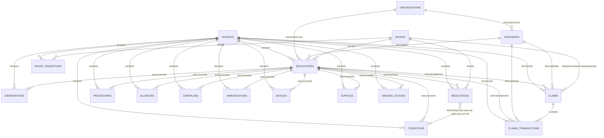

# Synthea Data Model — Reference

Generated from `synthea_data/output/csv/` (Massachusetts population export, ~2,300 patients). This maps how the 18 CSV files tie together so you don't have to reverse-engineer joins file by file. For dataset-specific quirks (missing fields, coverage percentages, structural gaps), see the design doc §4.3.2 — this file is purely about *structure*, not findings.

---

## 1. The three key types you'll see everywhere

| Key pattern | Meaning |
|---|---|
| `Id` (in a file whose name is singular/an entity, e.g. `patients.Id`, `encounters.Id`) | Primary key of that table |
| `PATIENT` / `PATIENTID` | Foreign key → `patients.Id`. Every clinical/claims fact ties back to one patient. |
| `ENCOUNTER` / `APPOINTMENTID` | Foreign key → `encounters.Id`. Ties a clinical fact to the specific visit it happened during. Note `claims.APPOINTMENTID` and `claims_transactions.APPOINTMENTID` are the same encounter FK under a different column name. |

None of these are encrypted — they're plain UUIDs Synthea generates as join keys. `patients.csv` is the only file with human-readable identity fields (`FIRST`, `LAST`, `BIRTHDATE`, etc.); every other file just carries the UUID.

---

## 2. Entity groups

### 2.1 Core identity/visit spine

| Table | Primary key | Key columns | Purpose |
|---|---|---|---|
| `patients` | `Id` | `FIRST`, `LAST`, `BIRTHDATE`, `GENDER`, `RACE`, `ADDRESS`, `HEALTHCARE_EXPENSES`, `HEALTHCARE_COVERAGE`, `INCOME` | One row per synthetic patient. Everything else hangs off this. |
| `encounters` | `Id` | `PATIENT`, `ORGANIZATION`, `PROVIDER`, `PAYER`, `ENCOUNTERCLASS`, `CODE`/`DESCRIPTION`, `BASE_ENCOUNTER_COST`, `TOTAL_CLAIM_COST`, `PAYER_COVERAGE`, `REASONCODE`/`REASONDESCRIPTION` | One row per clinical visit. The hub every clinical-event table hangs off (via `ENCOUNTER`). |
| `organizations` | `Id` | `NAME`, `ADDRESS`, `REVENUE`, `UTILIZATION` | The facility (clinic/hospital) where an encounter happened. Referenced by `encounters.ORGANIZATION` and `providers.ORGANIZATION`. |
| `providers` | `Id` | `ORGANIZATION`, `NAME`, `SPECIALITY`, `ENCOUNTERS`, `PROCEDURES` | The clinician. Referenced by `encounters.PROVIDER` and multiple provider-role columns in `claims`/`claims_transactions`. |

### 2.2 Clinical events (all key off `PATIENT` + `ENCOUNTER`)

| Table | Extra key columns | Purpose |
|---|---|---|
| `conditions` | `CODE`/`DESCRIPTION` (SNOMED), `START`/`STOP` | Diagnoses, active over a date range. |
| `observations` | `CATEGORY`, `CODE`/`DESCRIPTION`, `VALUE`, `UNITS`, `TYPE` | Labs, vitals, survey responses. `TYPE == "numeric"` is what you trend (e.g. creatinine); `TYPE == "text"` rows are structured survey fields, not free-text notes (see design doc). |
| `medications` | `PAYER`, `CODE`/`DESCRIPTION`, `REASONCODE`/`REASONDESCRIPTION`, `DISPENSES`, `TOTALCOST` | Prescriptions. `REASONCODE` links a med back to the *condition* it treats — this is your causal-chain data (e.g. tacrolimus → renal transplant). Also carries its own `PAYER` FK, separate from the encounter's payer. |
| `procedures` | `CODE`/`DESCRIPTION`, `BASE_COST`, `REASONCODE`/`REASONDESCRIPTION` | Procedures performed during an encounter. |
| `allergies` | `CODE`/`DESCRIPTION`, `TYPE`, `CATEGORY`, `REACTION1/2`, `SEVERITY1/2` | Allergy records, opened at a given encounter. |
| `careplans` | `Id` (yes, has its own PK), `CODE`/`DESCRIPTION`, `REASONCODE`/`REASONDESCRIPTION` | Ongoing care plans, e.g. "fracture care" tied to a condition. |
| `immunizations` | `CODE`/`DESCRIPTION`, `BASE_COST` | Vaccinations given at an encounter. |
| `devices` | `CODE`/`DESCRIPTION`, `UDI` | Medical devices attached/fitted at an encounter. |
| `supplies` | `CODE`/`DESCRIPTION`, `QUANTITY` | Consumable supplies used at an encounter. |
| `imaging_studies` | `Id`, `SERIES_UID`, `BODYSITE_CODE`, `MODALITY_CODE`, `PROCEDURE_CODE` | Imaging study *metadata* only — no actual images (design doc §4.5). |

### 2.3 Insurance / claims

| Table | Primary key | Key columns | Purpose |
|---|---|---|---|
| `payers` | `Id` | `NAME`, `OWNERSHIP`, `AMOUNT_COVERED`, `COVERED_ENCOUNTERS`, etc. | The insurer (e.g. Medicare). Referenced by `encounters.PAYER`, `medications.PAYER`, `payer_transitions.PAYER/SECONDARY_PAYER`, and `claims.PRIMARYPATIENTINSURANCEID/SECONDARYPATIENTINSURANCEID` (misleadingly named — these are payer IDs, not a separate insurance-policy table). |
| `payer_transitions` | none (junction) | `PATIENT`, `PAYER`, `SECONDARY_PAYER`, `START_DATE`/`END_DATE` | Which payer covered a patient over which date range — a patient can have multiple rows as coverage changes over time. |
| `claims` | `Id` | `PATIENTID`, `PROVIDERID`, `PRIMARYPATIENTINSURANCEID`, `APPOINTMENTID` (→ `encounters.Id`), `DIAGNOSIS1-8` (SNOMED codes, not FKs), `STATUS1`/`STATUS2`/`STATUSP` | One claim per billable encounter. `STATUS*` is always `BILLED`/`CLOSED` in this dataset — no `DENIED` state exists (design doc §4.3.2). |
| `claims_transactions` | `ID` | `CLAIMID` (→ `claims.Id`), `PATIENTID`, `APPOINTMENTID` (→ `encounters.Id`), `PROCEDURECODE`, `AMOUNT`, `PAYMENTS`, `ADJUSTMENTS`, `OUTSTANDING` | Line-item charges within a claim — this is the actual billing detail (2.2M+ rows at the ~2,300-patient dev scale). Many rows per claim. |

---

## 3. Entity-relationship diagram



*(The `MEDICATIONS → CONDITIONS` link is drawn dashed conceptually — `REASONCODE` is a SNOMED code match, not a hard foreign key to a `conditions` row, but it's the causal link the anchor scenario depends on.)*

---

## 4. Practical join recipes

**Get a patient's full clinical timeline for one encounter:**
```python
encounter_id = "..."
for name, df in {"conditions": conditions_df, "medications": medications_df,
                  "procedures": procedures_df, "observations": observations_df}.items():
    print(name, df[df["ENCOUNTER"] == encounter_id])
```

**Attach human-readable names to any clinical table:**
```python
allergies_df.merge(patients_df[["Id", "FIRST", "LAST"]], left_on="PATIENT", right_on="Id")
```

**Trace a claim to its clinical justification:**
```python
claims_df.merge(encounters_df, left_on="APPOINTMENTID", right_on="Id", suffixes=("_claim", "_encounter"))
```

**Why was a medication started (causal chain):**
```python
medications_df.merge(conditions_df, left_on=["PATIENT", "REASONCODE"], right_on=["PATIENT", "CODE"], suffixes=("_med", "_cond"))
```

---

## 5. Where to look next

- **Join safety (cardinality, fan-out, dedup) for every join in this file** → `join_reference.md`.
  Read it before writing any SQL that joins two of these tables together - several of the joins
  above look like simple 1:1 lookups but aren't (e.g. `claims.APPOINTMENTID`, `REASONCODE` causal
  chains, any two clinical tables joined directly on `ENCOUNTER`).
- Dataset-specific findings (coverage %, missing fields, what's NOT queryable) → design doc §4.3.2 and §4.5.
- How this schema maps to Postgres tables/Alembic migrations → design doc §5, Phase 0.
- RBAC scoping over this schema (Doctor vs. Insurance Adjuster column/table access) → design doc §2.2.
